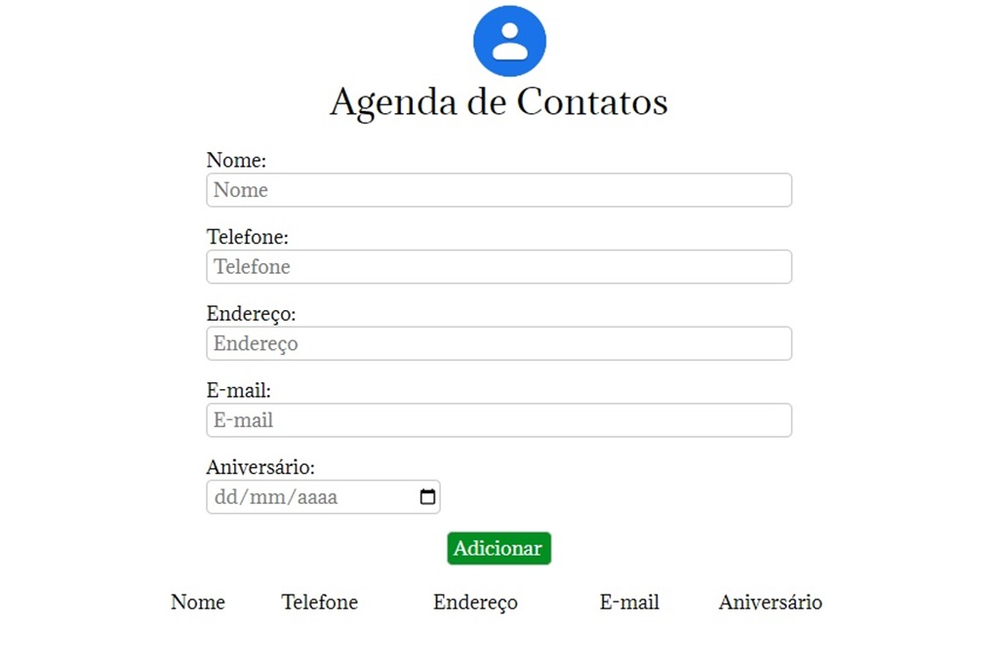

# Agenda

Acesso: https://kaiocesarnp.github.io/agenda/

Site em uma única página HTML e utilizando CSS; a implementação do projeto é escrita em Javascript;

É possível adicionar nome, telefone, endereço, e-mail e data de aniversário.
Ao tentar adicionar um contato faltando alguma das partes citadas, uma mensagem de alerta é exibida informando que se deve preencher todo o formulário para adicionar um novo contato.
Ao preencher tudo e clicar em "Adicionar", o novo contato com seus dados é exibido numa lista abaixo do formulário, onde cada informação ocupa uma coluna.

